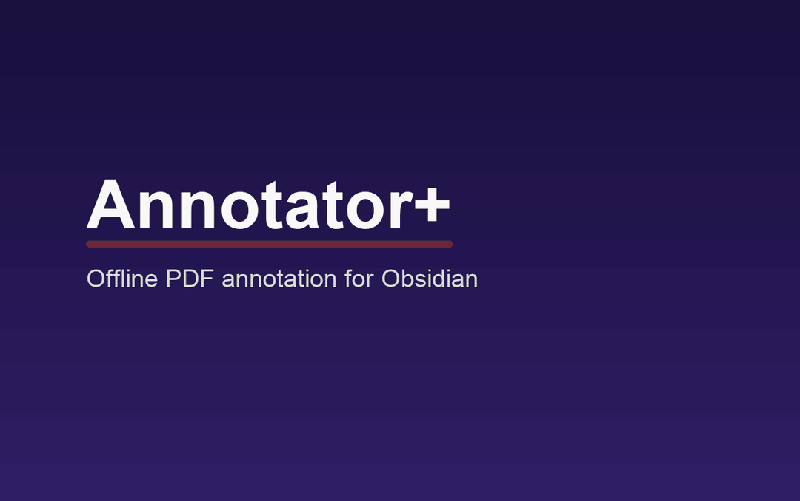

# Annotator+

[](https://github.com/0shombh-d3v/annotator-plus/actions/workflows/ci.yml)
[](https://github.com/0shombh-d3v/annotator-plus/releases/latest)
[](LICENSE.TXT)

Annotator+ is an offline, vault-local PDF annotation plugin for Obsidian. It is a fork of [Obsidian Annotator](https://github.com/elias-sundqvist/obsidian-annotator) by [Elias Sundqvist](https://github.com/elias-sundqvist), with the original Git history and contributor record preserved.

Annotations remain in the Markdown note that opened the PDF. Annotator+ has no account, cloud sync, telemetry, or remote-document support.



## What Annotator+ adds

- A dark-red underline marks PDF highlights that contain a written note; plain highlights stay yellow only.
- Underlines remain crisp at every zoom level and support click and keyboard activation.
- The sidebar can switch between **All** highlights and **Notes** while keeping **Page Notes** separate.
- Appearance can follow Obsidian live, stay always dark, or stay always light.
- Dark mode uses a higher-contrast amber highlight while keeping the red note underline visible.
- The PDF reader and annotation interface are bundled; document and annotation data remain in the vault.
- The reader blocks external documents, resources, and navigation.

Annotator+ is desktop-only and supports PDF files stored inside the current vault.

## Install

### From a release

1. Download `main.js` and `manifest.json` from the [latest release](https://github.com/0shombh-d3v/annotator-plus/releases/latest), or use the release ZIP.
2. Create `<vault>/.obsidian/plugins/annotator-plus/` and place `main.js` and `manifest.json` inside it.
3. Reload Obsidian, then enable **Annotator+** under **Settings → Community plugins**.

The release also includes a ZIP and `SHA256SUMS`. [BRAT](https://github.com/TfTHacker/obsidian42-brat) users can add `0shombh-d3v/annotator-plus` directly.

## Use

Add an `annotation-target` property to a Markdown note:

```yaml
---
annotation-target: PDFs/my-book.pdf
---
```

`annotation-target` must be one complete vault-relative path ending in `.pdf`. Absolute paths, `file://` URLs, web URLs, path traversal, lists, and non-PDF files are rejected. Open the note menu and choose **Annotate**, then select text in the PDF. Add text to a highlight to give it a dark-red underline. In the sidebar, choose **Notes** to see only highlights with written notes.

The legacy `annotation-target-type` property is ignored. Existing annotation blocks are not rewritten.

Use **Open as Markdown** to inspect or edit the stored blocks. Text in the `%%COMMENT%%` region may be edited freely. Avoid changing annotation IDs or the JSON/selector structure. Renaming a target file breaks its existing association unless the note's `annotation-target` is updated.

## Appearance

Under **Settings → Annotator+ → Annotator appearance**, choose:

- **Follow Obsidian** (default): changes immediately with Obsidian's theme.
- **Always dark**.
- **Always light**.

No Obsidian restart is required.

## Privacy and security

- Annotations are stored in your vault note, not in a remote annotation account.
- Only the exact PDF named by `annotation-target` can be read, and it must exist inside the vault.
- The embedded reader denies outbound HTTP, HTTPS, and WebSocket access. External links and missing resources are blocked.
- PDF JavaScript, external auto-links, model downloads, editing tools, printing, saving, and presentation mode are disabled.

Treat PDFs from unknown sources as untrusted files and keep Obsidian and Annotator+ updated. See [SECURITY.md](SECURITY.md) for reporting vulnerabilities.

## Build and contribute

Source, vendored reader code, tests, and release automation all live in this one repository. See [CONTRIBUTING.md](CONTRIBUTING.md). Release notes are in [CHANGELOG.md](CHANGELOG.md), and bundled-project attribution is in [THIRD_PARTY_NOTICES.md](THIRD_PARTY_NOTICES.md).

The 0.5.0 reader stack is reproducibly pinned to PDF.js 6.2.108, Hypothesis client commit `b4d085a2f893aa6de3b61d8b8bc3ae4d0f24fc1a`, and Dark Reader 4.9.128. These are bundled locally; Annotator+ does not download executable code at runtime.

## Credits and license

Annotator+ would not exist without the work of Elias Sundqvist and every [Obsidian Annotator contributor](https://github.com/elias-sundqvist/obsidian-annotator/graphs/contributors), the [Hypothesis client](https://github.com/hypothesis/client), [PDF.js](https://github.com/mozilla/pdf.js), [Dark Reader](https://github.com/darkreader/darkreader), and their contributors.

The fork is distributed under the [GNU Affero General Public License v3.0](LICENSE.TXT), matching the original project. Bundled components retain their own licenses and copyright notices.
